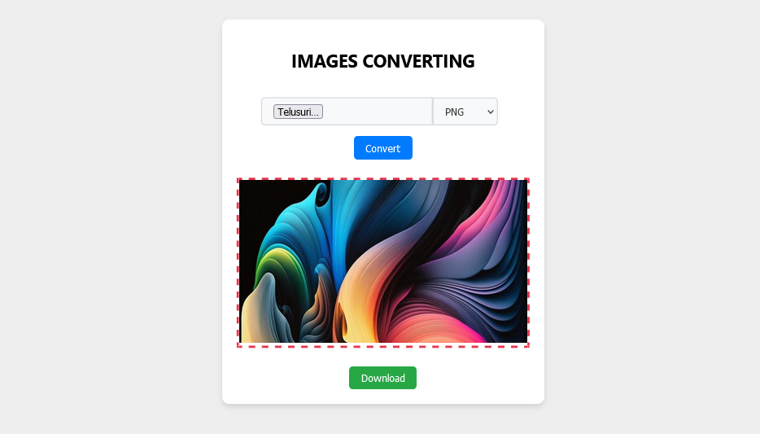

# ReactJS Images Converting

This simple ReactJS project that I created to convert image file extensions supports jpg, png, webp.



## Installation
```sh
git clone https://github.com/fitri-hy/react-images-converter.git
cd react-images-converter
npm install
```

## Components Only

Go to the `src` folder and copy the `components` folder and its contents to your react project.

**Impport components**

```sh
import ImagesConverting from './components/ImagesConverting';
```
**Call Component**

```sh
<ImagesConverting />
```
**Code Example (App.js)**
```
import ImagesConverting from './components/ImagesConverting';
import './App.css';

function App() {
  return (
    <div className="App">
      <ImagesConverting />
    </div>
  );
}

export default App;

```

## Change Appearance
You can change/customize the appearance in the `style.css` file


I didn't encrypt this repository for you to develop in it. If there are problems, please tell me the problem and I will fix it immediately, don't forget to give a star.

Hope it is useful,
Warm greetings from me.

Official Site: <a href="https://hy-tech.my.id/">VISIT</a>

